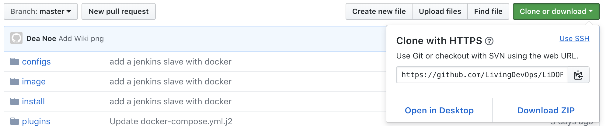
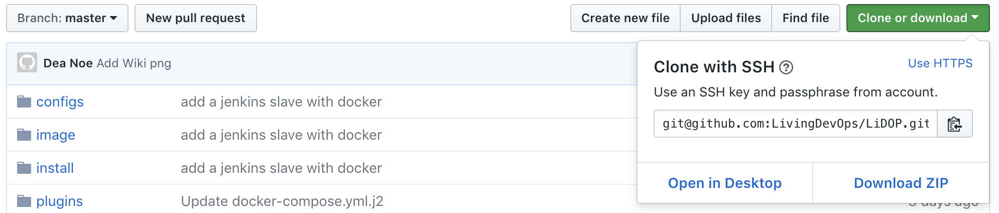
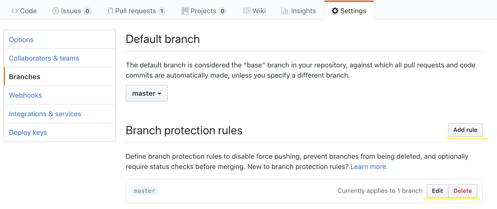
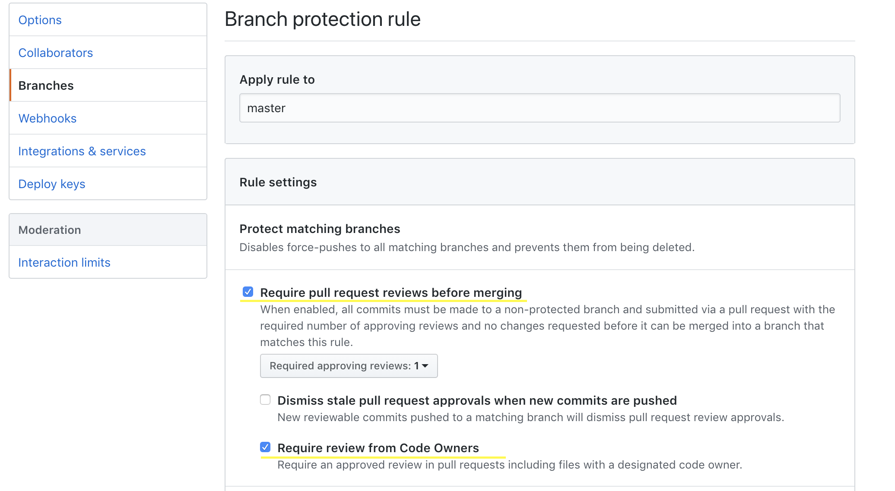

# Github tutorial

> GitHub is a code hosting platform for version control and collaboration. It lets you and others work together on projects from anywhere.

[https://guides.github.com/introduction/flow/](https://guides.github.com/introduction/flow/)
[https://guides.github.com/activities/hello-world/#what](https://guides.github.com/activities/hello-world/#what)

## Create a repository

[https://guides.github.com/activities/hello-world/#repository](https://guides.github.com/activities/hello-world/#repository)

### Create a branch

[https://guides.github.com/activities/hello-world/#branch](https://guides.github.com/activities/hello-world/#branch)

## Clone repositories

There are possible option to clone a repository:

- HTTPS
- SSH

> HTTPS is less likely to be blocked by a firewall.
> [https://help.github.com/articles/which-remote-url-should-i-use/](https://help.github.com/articles/which-remote-url-should-i-use/)
>
> The `https://` clone URLs are available on all repositories, public and private. These URLs work everywhere--even if you are behind a firewall or proxy.
> An HTTPS connection allows `credential.helper` to cache your password.
>
> [https://help.github.com/articles/set-up-git](https://help.github.com/articles/set-up-git)
> Good to know: The credential helper only works when you clone an HTTPS repo URL. If you use the SSH repo URL instead, SSH keys are used for authentication. While we do not recommend it, if you wish to use this method, check out this guide for help generating and using an SSH key.

Source: [Stackoverflow](https://stackoverflow.com/questions/11041729/why-does-github-recommend-https-over-ssh)

### Setup SSH

In order to use SSH you have to link a ssh key to your Github account. If already have an existing SSH key, you want to reuse, you can skip `Generate a new SSH key/pair`.

#### Generate a new SSH key/pair

On Windows you can use the git-bash to execute the commands or puttygen.

[https://help.github.com/articles/generating-a-new-ssh-key-and-adding-it-to-the-ssh-agent/](https://help.github.com/articles/generating-a-new-ssh-key-and-adding-it-to-the-ssh-agent/)

```sh
ssh-keygen -t rsa -b 4096 -C "your_email@example.com"
```

This command generates a key/pair in your user's home directory by default.

#### Add key to SSH agent

On Windows you can use the git-bash to execute the commands or pageant.

[https://help.github.com/articles/generating-a-new-ssh-key-and-adding-it-to-the-ssh-agent/](https://help.github.com/articles/generating-a-new-ssh-key-and-adding-it-to-the-ssh-agent/)

```sh
ssh-add -K ~/.ssh/id_rsa
```

This command adds the private key to your ssh-agent.

#### Add public SSH key to your account at GitHub

[https://help.github.com/articles/adding-a-new-ssh-key-to-your-github-account/](https://help.github.com/articles/adding-a-new-ssh-key-to-your-github-account/)

1. Navigate to  your [Key settings at GitHub](https://github.com/settings/keys)
2. Add your public ssh key

### Clone repository

#### Get the url

*HTTPS*:



*SSH*:



```sh
git clone <repo-url>
```

## Pull requests

> Pull requests let you tell others about changes you've pushed to a branch in a repository on GitHub. Once a pull request is opened, you can discuss and review the potential changes with collaborators and add follow-up commits before your changes are merged into the base branch.

[https://help.github.com/articles/about-pull-requests/](https://help.github.com/articles/about-pull-requests/)
[https://guides.github.com/activities/hello-world/#pr](https://guides.github.com/activities/hello-world/#pr)

If you want to assign users automatically reviewers to your pull request check the CODEOWNERS feature of GitHub.

### Code owners

[https://help.github.com/articles/about-codeowners/](https://help.github.com/articles/about-codeowners/)

Usage:

1. Add CODEOWNER file to your repo(check the link above)
2. Set branch protection rules to add codeowners by default as reviewers




## Wikis

> Just as writing good code and great tests are important, excellent documentation helps others use and extend your project.

[https://help.github.com/articles/about-github-wikis/](https://help.github.com/articles/about-github-wikis/)
[https://guides.github.com/features/wikis/](https://guides.github.com/features/wikis/)

## Issues

> Use issues to track ideas, enhancements, tasks, or bugs for work on GitHub.

[https://help.github.com/articles/about-issues/](https://help.github.com/articles/about-issues/)
[https://guides.github.com/features/issues/](https://guides.github.com/features/issues/)

## GitHub Pages

> GitHub Pages is a static site hosting service designed to host your personal, organization, or project pages directly from a GitHub repository.

[https://help.github.com/articles/what-is-github-pages/](https://help.github.com/articles/what-is-github-pages/)
[https://guides.github.com/features/pages/](https://guides.github.com/features/pages/)

## Webhooks

> Webhooks provide a way for notifications to be delivered to an external web server whenever certain actions occur on a repository or organization.

[https://help.github.com/articles/about-webhooks/](https://help.github.com/articles/about-webhooks/)
[https://developer.github.com/webhooks/](https://developer.github.com/webhooks/)

## GitHub Apps

> You can build integrations with the GitHub APIs to add flexibility and reduce friction in your own workflow. You can also share integrations with others on GitHub Marketplace or Works with GitHub.

[https://developer.github.com/apps/about-apps/](https://developer.github.com/apps/about-apps/)
[GitHub Marketplace](https://github.com/marketplace)

There are many apps available at GitHub which you can integrate with your repository or you can build them on your own.

Some example for existing Apps:

- Codacy: Automated code analysis/quality tool, free for open source projects
- Circle CI: CI tool, 1500 minutes/month for free
- Waffle: Automated project management powered by your GitHub issues & pull requests, free for open source projects
- Slack: Chat Bot for Slack

## Other useful plugin/tools

- [VSCode github plugin](https://code.visualstudio.com/blogs/2018/09/10/introducing-github-pullrequests): Manage pull requests directly from VSCode
